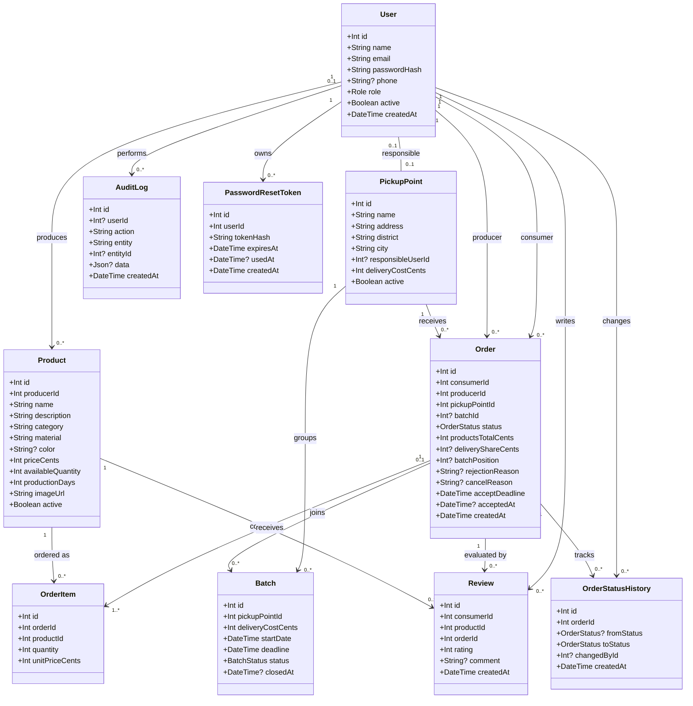

# Diagrama de classes do PrintHub Regional

Derivado dos modelos e campos do `backend/prisma/schema.prisma`.

```mermaid
classDiagram
  class User {
    +Int id
    +String name
    +String email
    +String passwordHash
    +String? phone
    +Role role
    +Boolean active
    +DateTime createdAt
  }
  class Product {
    +Int id
    +Int producerId
    +String name
    +String description
    +String category
    +String material
    +String? color
    +Int priceCents
    +Int availableQuantity
    +Int productionDays
    +String imageUrl
    +Boolean active
  }
  class PickupPoint {
    +Int id
    +String name
    +String address
    +String district
    +String city
    +Int? responsibleUserId
    +Int deliveryCostCents
    +Boolean active
  }
  class Order {
    +Int id
    +Int consumerId
    +Int producerId
    +Int pickupPointId
    +Int? batchId
    +OrderStatus status
    +Int productsTotalCents
    +Int? deliveryShareCents
    +Int? batchPosition
    +String? rejectionReason
    +String? cancelReason
    +DateTime acceptDeadline
    +DateTime? acceptedAt
    +DateTime createdAt
  }
  class OrderItem {
    +Int id
    +Int orderId
    +Int productId
    +Int quantity
    +Int unitPriceCents
  }
  class Batch {
    +Int id
    +Int pickupPointId
    +Int deliveryCostCents
    +DateTime startDate
    +DateTime deadline
    +BatchStatus status
    +DateTime? closedAt
  }
  class Review {
    +Int id
    +Int consumerId
    +Int productId
    +Int orderId
    +Int rating
    +String? comment
    +DateTime createdAt
  }
  class OrderStatusHistory {
    +Int id
    +Int orderId
    +OrderStatus? fromStatus
    +OrderStatus toStatus
    +Int? changedById
    +DateTime createdAt
  }
  class AuditLog {
    +Int id
    +Int? userId
    +String action
    +String entity
    +Int? entityId
    +Json? data
    +DateTime createdAt
  }
  class PasswordResetToken {
    +Int id
    +Int userId
    +String tokenHash
    +DateTime expiresAt
    +DateTime? usedAt
    +DateTime createdAt
  }

  User "1" --> "0..*" Product : produces
  User "1" --> "0..*" Order : consumer
  User "1" --> "0..*" Order : producer
  User "0..1" -- "0..1" PickupPoint : responsible
  User "1" --> "0..*" Review : writes
  User "1" --> "0..*" OrderStatusHistory : changes
  User "0..1" --> "0..*" AuditLog : performs
  User "1" --> "0..*" PasswordResetToken : owns
  PickupPoint "1" --> "0..*" Order : receives
  PickupPoint "1" --> "0..*" Batch : groups
  Order "0..1" --> "0..*" Batch : joins
  Order "1" --> "1..*" OrderItem : contains
  Product "1" --> "0..*" OrderItem : ordered as
  Order "1" --> "0..*" OrderStatusHistory : tracks
  Order "1" --> "0..*" Review : evaluated by
  Product "1" --> "0..*" Review : receives
```
